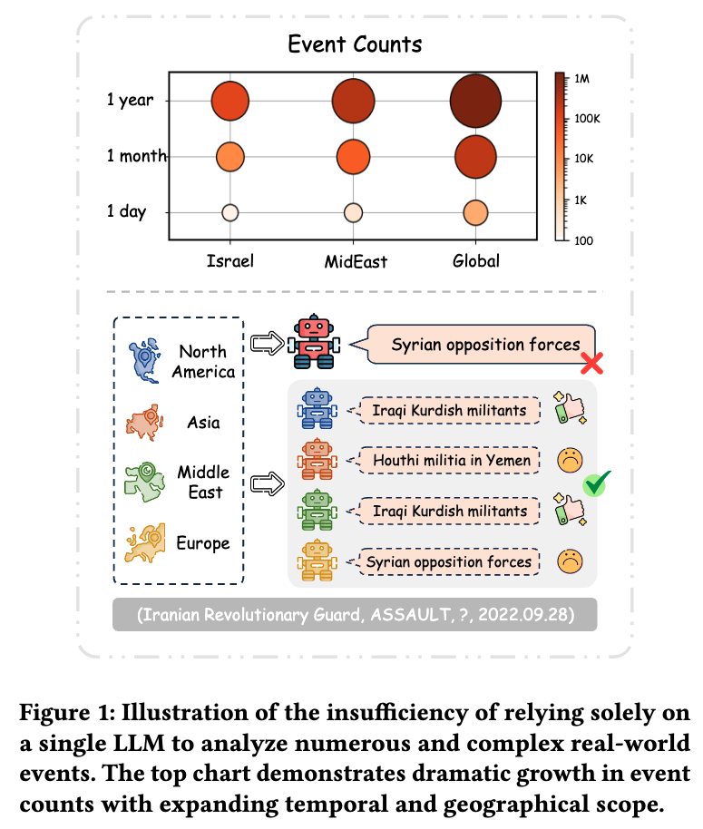
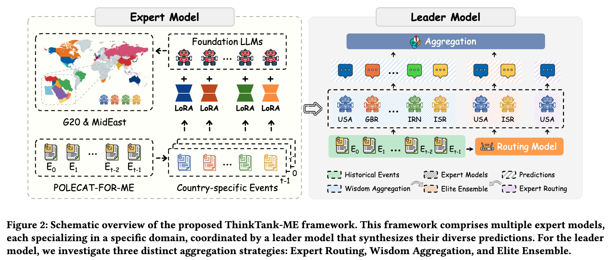
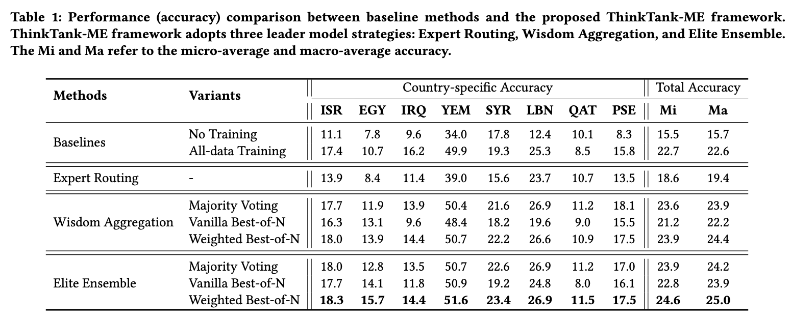
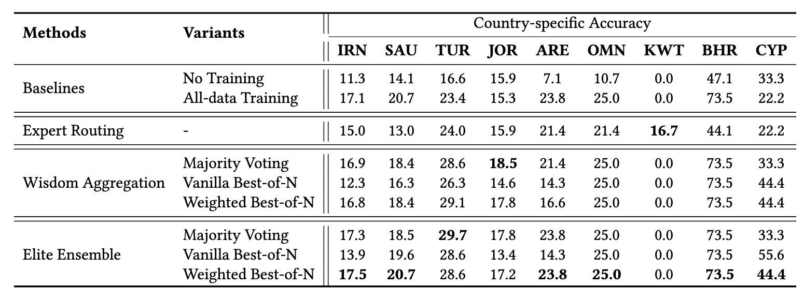
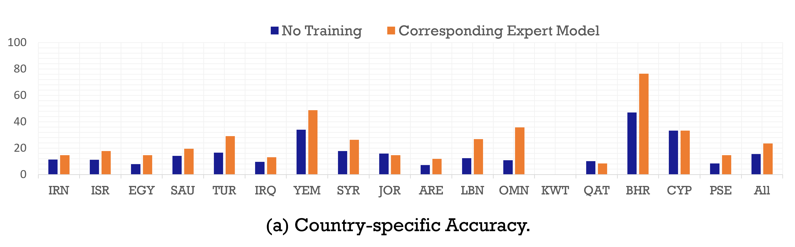
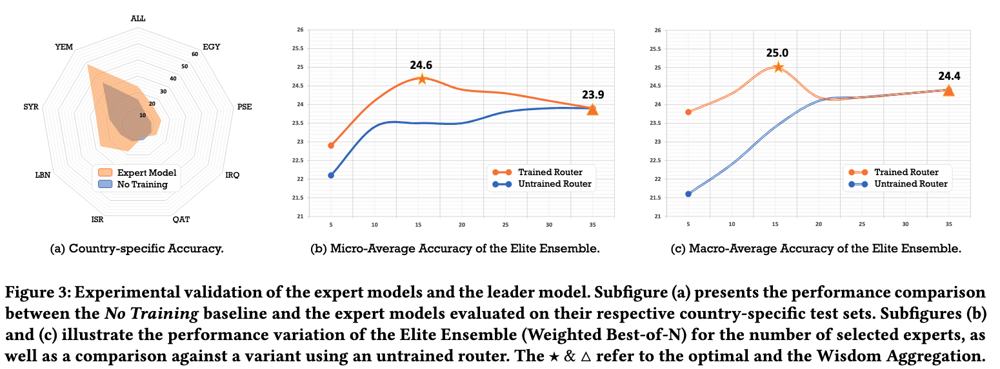

# ThinkTank-ME

This repository contains the code, dataset construction pipeline, and more experiment results for the paper titled "ThinkTank-ME: A Multi-Expert Framework for MidEast Event Forecasting".

## Motivation

<p align="center">
  
</p>


## Framework



## Experiments






## Prompts

### For the expert model:
```
System:
You are a think tank expert specializing in the political, military, and economic dynamics of {country}. You possess extensive knowledge of historical and contemporary events, policies, and strategies relevant to {country} and its interactions with other nations. Your expertise includes identifying patterns and trends in historical and current events, interpreting complex geopolitical contexts, and delivering informed predictions.

Your task is to analyze [Historical Events] and predict the most likely object for a [Current Event to Predict]. [Historical Events] consist of a series of timestamped event sets, with each set containing multiple atomic events. The [Current Event to Predict] is presented as a query requiring the identification of the most plausible object, based on the given subject, relationship, and timestamp. Each timestamp is represented as [year-month-day], and atomic events are formatted as triples [subject, relation, object]. For example, [France, REQUEST_meet, Russia] indicates that  'France' (subject) has the relation 'REQUEST_meet' with 'Russia' (object).

User:
[Historical Events]:
{historical_events}
[Current Event to Predict]:
{current_event}

Please use your deep understanding of {country_name_i}'s internal and external dynamics, as well as the broader geopolitical environment, to deliver accurate, contextually informed predictions. Only provide the missing object without additional explanation.

Assistant:
{Object}
```

### For the routing model:

<details>
<summary>The prompts are as follows:</summary>

```
System:
Your task is to analyze [Historical Events] and [Current Event to Predict], and then select the most appropriate expert by reasoning from among the candidates to make a prediction.

[Candidates] consist of the nationalities of different experts. [Historical Events] consist of a series of timestamped event sets, with each set containing multiple atomic events. The [Current Event to Predict] is presented as a query requiring the identification of the most plausible object, based on the given subject, relationship, and timestamp. Each timestamp is represented as [year-month-day], and atomic events are formatted as triples [subject, relation, object]. For example, [France, REQUEST_meet, Russia] indicates that  'France' (subject) has the relation 'REQUEST_meet' with 'Russia' (object).

User:
[Historical Events]:
{historical_events}
[Current Event to Predict]:
{current_event}
[Candidates]:
['Iran', 'Israel', 'Egypt', 'Saudi Arabia', 'Turkey', 'Iraq', 'Yemen', 'Syria', 'Jordan', 'United Arab Emirates', 'Lebanon', 'Oman', 'Kuwait', 'Qatar', 'Bahrain', 'Cyprus', 'Palestine', 'China', 'United States', 'Russia', 'United Kingdom', 'France', 'Germany', 'Korea', 'Japan', 'India', 'Canada', 'Italy', 'Australia', 'Spain', 'Argentina', 'Brazil', 'Indonesia', 'Mexico', 'South Africa']

Please use your deep understanding of the predicted events and the broader geopolitical environment, to deliver accurate, contextually informed selections. Only provide the nationality of the expert without additional explanation. 

Assistant:
{Expert}
```


</details>

## POLECAT-FOR-ME

### Dataset Extraction
**Extract by country.** Use ``divided_by_country.py`` to extract the needed csv file (``MidEast.csv``) from the original ``.txt`` files.
```python
# original file path
directory = 'PATH_TO_ORIGINAL_FILES'

# select the event from the right country
if country.lower() in ['iran', 'israel', 'egypt', 'saudi arabia', 'irn','isr','egy', 'sau' ...]:
    return True
```

**Remove rows lacking entity information.** (``dataset_construction.ipynb 1-3 blocks``) Rows are removed where both the values of the columns 'name' and 'raw name' are listed as 'None' or np.Nan (empty value) for the actor (subject) and recipient (object).

**Entity expansion.** (``dataset_construction.ipynb 4 block``) In this phase, rows containing multiple entities were split into multiple events to ensure each entity was represented as a separate entry. If "name" is None, "raw name" will be used instead (set the attribute "isReplace" = True). Finally get the ``MidEast_expanded.csv``.
```python
# Expand rows for 'Actor Name' and 'Recipient Name' with their respective raw fields
# the second command input is 'df_expand_actor' (the output of first command)
df_expand_actor = expand_rows(df, 'Actor Name', 'Actor Name Raw')
df_expand = expand_rows(df_expand_actor, 'Recipient Name', 'Recipient Name Raw')
```

**Deduplication.** (``dataset_construction.ipynb 5 block``) The dataset was further refined by removing duplicate events based on Actor Name, Recipient Name, Event Type, Event Mode, and Event Date. Finally get the ``MidEast_deduplicated.csv``.
```python
# Remove duplicates based on all specified columns being the same
df_deduplicated = df_expand.drop_duplicates(subset=['Actor Name', 'Recipient Name', 'Event Type','Event Mode', 'Event Date'])
```

**Entity Filter.** Filter out meaningless entities by GPT. Only focus on the rows which "isReplace" = True. Because the original "name" is validated. 
```python
entitis_actor = set(df_deduplicated[(df_deduplicated['Actor Name isReplace'] == True)]['Actor Name'].unique())
entitis_recipient = set(df_deduplicated[(df_deduplicated['Recipient Name isReplace'] == True)]['Recipient Name'].unique())
unique_entities = set(entitis_actor).union(entitis_recipient)
```
First, the first round of judgment of ENTITY validity is performed by the GPT model. (``dataset_construction.ipynb 8-10 block``) Finally get the ``ent_recheck_results.json`` and ``ent_recheck.json``.
```python
# ent_recheck_results: all entity result. Form: entity_name: is_validity
# entit_recheck: the entity which need recheck
entit_recheck_results = check_entities(unique_entities)
entit_recheck = [ent for ent,v in entit_recheck_results.items() if v==False]
with open('./ent_check/ent_recheck_results.json','w') as f:
    json.dump(entit_recheck_results,f,indent=2,ensure_ascii=False)
with open('./ent_check/ent_recheck.json','w') as f:
    json.dump(entit_recheck,f,indent=2,ensure_ascii=False)
```
Slect the entities which count > 5 in the `ent_recheck` (`dataset_construction.ipynb 12 block`). Finally get the ``ent_maybe_list.json``.

Next, do the second round of judgment of ENTITY validity by the GPT model in the `ent_maybe_list`. Finally get the ``ent_final_results.json`` and ``ent_final.json``.

Finally, filter the entity by the ``ent_final.json``, ``ent_final_results.json``, and ``ent_recheck.json``. Get the `MidEast_filtered.csv`.
```python
ent_final_list = [ent for ent in ent_final_results.keys() if ent not in ent_final] # final YES
ent_recheck_list = [ent for ent in ent_recheck if ent not in ent_final_list]
df_filtered = df_deduplicated[~((df_deduplicated['Actor Name'].isin(ent_recheck_list))|(df_deduplicated['Recipient Name'].isin(ent_recheck_list)))]

df_filtered.to_csv('./final/MidEast_filtered.csv', index=False)
```

**Post Process.** Convert the 'Event Date' column to datetime format (`dataset_construction.ipynb 22 block`). Finally get the `MidEast_date.csv`. 

### Historical Event Construction (Complex Event)

Based on the `MidEast_date.csv`, we retain the necessary attributes and generate the `MidEast.csv` for historical event cosntruction (`dataset_construction.ipynb 23 block`).
```python
def truncate_string(value):
    return value.split('_')[0]

all_df = all_df.loc[:, ["Event ID", 'Actor Name', 'Event Type', 'Event Mode', 'Recipient Name', "Event Date", "Contexts", "Actor Country", "Recipient Country", "Country", "Story People", "Story Organizations", "Story Locations"]]
all_df["Md5"] = all_df["Event ID"].apply(truncate_string)
all_df = all_df.sort_values(by=['Event Date'], ignore_index=True)
all_df.to_csv('../2_historical_event/MidEast.csv', index=False)
```

#### Building the article content

Due to the lack of original articles, we need to build article content for clustering (`generate_article.ipynb`).

First, we extract the required attributes from `MidEast.csv`.
```python
news_article[id_news_i][id_i] = {"Subject": subject_i, "Relation": relation_i,"Object":object_i, "Contexts": c_i, "Date":date_i,"Story People":s_p,"Story Organizations": s_o,"Story Locations":s_l}
```

Next, we construct example sentences for each event type manually. Finally, we construct the `news_article_final.json` which includes the constructed article content and date.

#### Clustering

We generate required documents in advance for clustring, mainly involves time emebdding, doc embedding, and dimensionality reduction embedding (`get_required_files.py`).

Following, we perform clustering by BERTopic (`clustering.py`). The specific method is the HDBSCAN method. The time weight parameter is 1.0 and the minimum cluster size is 20 (when the number of countries becomes larger, the parameter size needs to be reconsidered). Considering the time dimension, we add the  `fit_time_umap()` function for BERTopic. 
<details>
<summary>The specific changes are as follows:</summary>

```python
def fit_transform_time_umap(
    self,
    documents: List[str],
    embeddings: np.ndarray = None,
    time_embs: np.ndarray = None,
    umap_embs: np.ndarray = None,
    images: List[str] = None,
    y: Union[List[int], np.ndarray] = None,
    save_path = None,
) -> Tuple[List[int], Union[np.ndarray, None]]:

......
# Guided Topic Modeling

umap_embeddings = umap_embs
logger.info('shape: ' + str(umap_embeddings.shape))

# Normlization
logger.info('start umap emb normalization')
umap_embeddings = normalize(umap_embeddings, norm='l2')
logger.info('Umap emb l2 normalized')

# Concat time feature
logger.info('start adding time feature')
time_embs = np.expand_dims(time_embs, axis=1)
umap_embeddings_time = np.concatenate((umap_embeddings, time_embs), axis=1)
logger.info('shape: ' + str(umap_embeddings_time.shape))

umap_embeddings = umap_embeddings_time

# Zero-shot Topic Modeling
......
```
</details>

Finally, we get mainly the `result.csv`, `t1_m20_raw.csv`, and `topic_info.csv` files. `result.csv`: illustrates the event number and the nday attribute of cluster. `t1_m20_raw.csv`: generates from `MidEast.csv` which have extra `Topic` and `Nday` attributes.

#### Data Cleaning

`clean_ce.ipynb`

Operation 1: We merge atomic events if they have the same (subject, relation, object, time, ceid).
```python
grouplist = list(df_raw.groupby(['Actor1Name', 'EventType', 'Actor2Name', 'day', 'Topic', 'timid']))
```

Operation 2: We split too large complex events by max date range = 30 , and max atomic event number = 100. 
```python
ce_pd_splitted = []
# from tipicid 0
for topicid in range(0, topicid_max + 1):
    ce_pd = ce_df[ce_df['Topic']==topicid]
    ce_pd = ce_pd.sort_values(by=['day'], ignore_index=True)
    curr_rowid = 0
    while curr_rowid <= (len(ce_pd)-1):
        next_rowid = min(curr_rowid + max_n_events-1, len(ce_pd)-1)
        next_row = ce_pd.iloc[[next_rowid]]
        next_timid = next_row['timid'].values[0]
        curr_row = ce_pd.iloc[[curr_rowid]]
        curr_timid = curr_row['timid'].values[0]
        n_range = next_timid - curr_timid + 1
        if n_range <= max_n_range: # split by max_n_events
            ce_pd_splitted.append(ce_pd[curr_rowid: next_rowid+1])
            curr_rowid = next_rowid+1
        else: # split by n_range
            next_rowid = len(ce_pd[ce_pd['timid'] <= (curr_timid+max_n_range-1)]) - 1
            ce_pd_splitted.append(ce_pd[curr_rowid: next_rowid+1])
            curr_rowid = next_rowid+1   
```

Operation 3: We filter out complex events into outliers if they do not have min date range = 3 and min atomic event number = 20.

Finally, we get the `MidEast_Raw.csv` file.

### Country-specific Dataset Construction

Firstly, split the datasets with complex event into country dataset based on the `Actor Country`, `Recipient Country`, and `Country` attributes (`split_country.py`, get the `all_data.csv` for each country).

Simultaneously, the set of historical events is constructed based on the complex event id (`get_context.ipynb`). We will get the `context_mideast_max100_min20.json` file (Key: ce id; Value: historical events).

For each individual country, use the `context_mideast_max100_min20.json` to construct the final training data (`get_real_data.py`, get the `train_object.json` & `val_object.json` & `test_object.json` for each country). **The test set division time points are aligned with the model pre-training knowledge cufoff.**

To aggregate the all datasets (train & val & test) across all countries. We use the `get_all_train_test.py` to generate the file `mideast_train_object.json` & `mideast_val_object.json` & `mideast_test_object.json`. The attributes of those files is as follow:
```json
{
    "0": {
        "system_prompt": "You are a think tank expert specializing in xxx",
        "input": "[Historical Events]:xxx. Only provide the missing object without additional explanation.",
        "target": "Houthi movement",
        "ce_id": "2932",
        "country_name": "iran",
        "country_code": "irn",
        "number_country": 0
    },
}
```

Next, to ensure the valid object generation during the inference, we use the `get_test_vocab.py (1,2 block)` to get test object token id (utilize the llama3.1 tokenizer, first get the `mideast_test_object_list.json` and then get the `id_term_rep_mideast_test_object_list.npy`). Due to the format of llama model, we use `271` & `128009` as begin id and end id. 

### Expert Routing Dataset Construction

To train the router to select the right expert according the query, we construct the training dataset.

First, we sample a subset of training set of event datasets, an average of 1000 samples were taken from each country (`1 block of routing_train_const.ipynb`, get the `train_country_select.json`).

Then, the 35 expert models predict the object on the subset, and get the `country_select_result.json` individually.

Based on the `country_select_result.json`, we aggregate the all prediction across all experts (`2 block of routing_train_const.ipynb`, get the `country_forecast_results.json`). Based on the `test_result.json`, we aggregate the all prediction across all experts (`4 block of routing_train_const.ipynb`, get the `country_forecast_results_test.json`).
The attributes as follow:
```json
"0": {
        "system_prompt": "You are a think tank expert xxx.",
        "input": "[Historical Events]:xxx.",
        "target": "Tehran",
        "ce_id": "18710",
        "country_name": "iran",
        "number_country": "96984",
        "output": {
            "iran": "Tehran",
            "israel": "Iranian generals",
            "xxx": "xxx"
        },
        "scores": {
            "iran": -1.6554224491119385,
            "israel": -13.269582748413086,
            "xxx": 0.0,
        },
        "correct_forecast": [
            "iran",
            "iraq"
        ],
        "correct_scores": [
            -1.6554224491119385,
            -2.0508363246917725
        ],
        "correct_max_country": "iran"
    },
```

Finally, based on the `country_forecast_results.json` and `country_forecast_results_test.json`, we construct the training and test dataset of Expert Routing Dataset. `4 block of routing_train_const.ipynb`, and get the `country_select_train_dataset.json`. `5 block of routing_train_const.ipynb` , and get the `country_select_test_dataset.json`.
    
Additionally, to ensure the valid generation of country selection, we use the `get_test_vocab.ipynb (3 block)` to get coutry id (utilize the llama3.1 tokenizer, get `id_term_rep_mideast_test_country_select_list.npy`). Due to the format of llama model, we use `271` & `128009` as begin id and end id.

## Think Tank Forecasting

### Expert Model

The backbone of expert model is `llama-3.1-7B`. Training and calling rely on [official Meta documentation](https://github.com/meta-llama/llama-recipes). 
- Training: `llama-recipes/src/llama_recipes/finetuning_llama31.sh`
- Evaluation: `llama-recipes/src/llama_recipes/test_precision.sh` and `llama-recipes/src/llama_recipes/test_precision.py`. Due to the valid of generation output, so we reconstruct the `llama` model by the `Trie` structure (`test_llama.py`).
```python
### trie ###
# print("############")
wordsets = WordSetIndex(save_dir="./",
                        sep_token_id=None,
                        pad_token_id=128009,
                        eos_token_id=128009)

wordsets_path = "PATH/id_term_rep_mideast_test_object_list.npy"
```

### Leader Model

#### Expert Routing

The backbone of routing model is also `llama-3.1-7B`.
- Training: `llama-recipes/src/llama_recipes/country_select/finetuning_country_select.sh`
- Evaluation: `llama-recipes/src/llama_recipes/country_select/test_country_select.sh` and `llama-recipes/src/llama_recipes/test_precision.py`. Due to the valid of generation output, so we reconstruct the `llama` model by the `Trie` structure (`test_llama.py`).

**Forecasting:** `expert_routing.ipynb`.

#### Wisdom Aggregation

**Forecasting:** 
- Majority Voting: `majority_voting.ipynb`.
- Best-of-N: `best_of_n.ipynb`.
    - 1 block: for the vanilla best-of-n.
    - 2 block: for the weighted best-of-n.

#### Elite Ensemble

**Forecasting:** `elite_ensemble.ipynb`.
- Majority Voting: 1 block.
- Vanilla Best-of-N: 2 block.
- Weighted Best-of-N: 3 block.